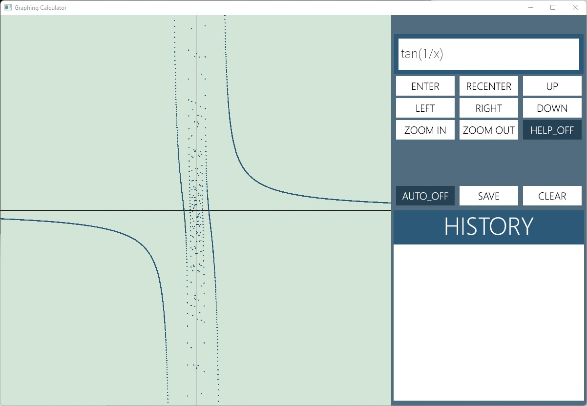
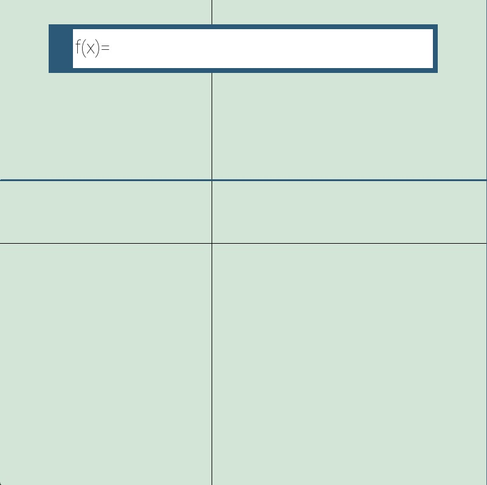
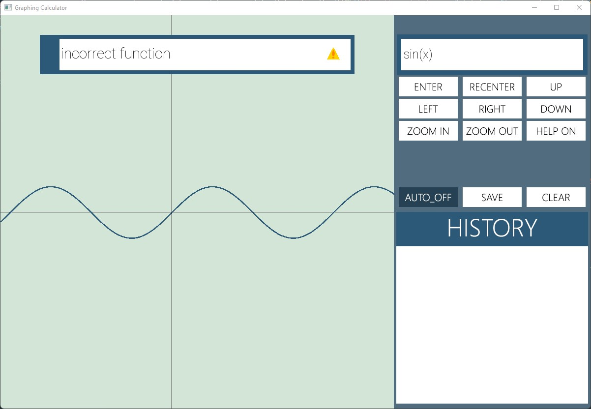

# Project Overview

This is a graphing calculator simulator project built based on the [SFML](https://www.sfml-dev.org "sfml-dv.org"), a simple multi-media library. 

It is able to function like a real graphing calculator. For detail functionailities, please check the [Functionaility](Functionaility.md) section.

# Getting Started

## Table of Contents

* [Project Overview](#project-overview)
  * [Quick Start](#quick-start)
  * [Graphing Calculator Instructions](#graphing-calculator-instructions)

# Quick Start

The repository only provides the source codes of the simulator. 

To compile the code, the following tools are required:

1. C++ compiler or compiling software (ex. [Qt Creator](https://www.qt.io/product/development-tools "QtCreator website"), [VSCode](https://code.visualstudio.com "VSCode Website"))
2. [SFML library](https://www.sfml-dev.org/tutorials/2.5/start-vc.php "sfml-tutorial")

If it compiles and builds correctly, you should see the Graphic Calculator window that looks like this:

# Graphing Calculator Instructions

For video explantions on the instructions, please click on the red button

 

For detail commands, please check the [Functionaility](Functionaility.md) section.

## Basic Instructions
In this section, it will introduce the basic instructions to use the graphing calculator.

You can also press the button  on the right panel to get breif instructions on each button.

By pressing the button , the help messages will disapear. 

## Table of Instructions
* [Basic Instructions](#basic-instructions)
  * [Enter Function](#enter-function)
  * [Move Around Graph](#move-around-graph)

## Enter Function
To change the function, first press the button  on the right panel or press 'Shift + F' on keyboard

Then, you will see a pop-up box on the left that looks like this:

Type in the function on the box with your keyboard and finish with pressing the enter key on your keyboard.

If you enter an incorrect graphing function, you will see a yellow warnning sign at the end of the box. The warnning sign will dispear when you enter a correct graphing function.

Below is an example:

To exit the input mode, press 'ESC' on the keyboard or enter a correct function. 

## Move Around Graph

You can move around the graph using the right panel /// or the arrow keys on your keyboard.
They will both allow you to shift Left/Right/Up/Down on the graph.

If 
